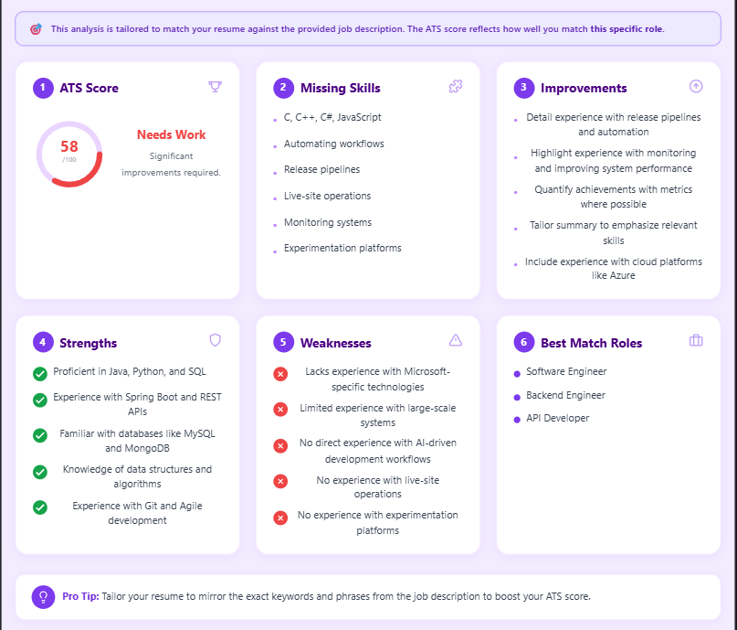

# 🤖 AI Resume Analyzer

An AI-powered resume analysis tool that gives you instant ATS scores, skill gap analysis, and job-description matching — built with React + Flask + OpenRouter.

> 🔗 **Live Demo:** [Click Here](https://ai-resume-analyzer-sand-six.vercel.app/)

---

## 📸 Preview



> *Upload your resume, get ATS score, strengths, weaknesses, missing skills, and best-match roles in seconds.*

---

## ✨ Features

- 📊 **ATS Score** — Instant 0–100 score with visual circular progress
- 🎯 **JD Match Mode** — Paste a job description to match your resume against a specific role
- 🔍 **General Analysis Mode** — Analyze resume quality without a JD
- 💡 **Missing Skills** — Skills you're lacking for the target role
- ✅ **Strengths & ❌ Weaknesses** — Honest breakdown of your resume
- 🚀 **Improvements** — Actionable suggestions to improve your resume
- 💼 **Best Match Roles** — Roles you're most suited for
- 📁 **Drag & Drop PDF Upload**

---

## 🛠️ Tech Stack

| Layer | Technology |
|---|---|
| Frontend | React (Vite) |
| Backend | Python, Flask |
| AI Model | Google Gemini 2.0 Flash (via OpenRouter) |
| PDF Parsing | PyPDF2 |
| API Client | openai (OpenRouter-compatible) |

---

## 📁 Project Structure

```
AI-RESUME-ANALYZER/
├── frontend/
│   └── src/
│       ├── App.jsx        # Main React component
│       ├── main.jsx
│       └── index.css
├── venv/
├── app.py                 # Flask backend
└── README.md
```

---

## 🚀 Getting Started

### Prerequisites
- Python 3.9+
- Node.js 18+
- An [OpenRouter](https://openrouter.ai) API key

### 1. Clone the repo

```bash
git clone https://github.com/YOUR_USERNAME/ai-resume-analyzer.git
cd ai-resume-analyzer
```

### 2. Backend setup

```bash
# Create and activate virtual environment
python -m venv venv
venv\Scripts\activate        # Windows
# source venv/bin/activate   # Mac/Linux

# Install dependencies
pip install flask flask-cors PyPDF2 openai
```

Open `app.py` and replace the API key:

```python
api_key="your-openrouter-api-key-here"
```

Start the Flask server:

```bash
python app.py
```

Backend runs on `http://127.0.0.1:5000`

### 3. Frontend setup

```bash
cd frontend
npm install
npm run dev
```

Frontend runs on `http://localhost:5173`

---

## 🔌 API Reference

### `POST /upload`

Analyzes a resume PDF.

**Form Data:**

| Key | Type | Required | Description |
|---|---|---|---|
| `resume` | File (PDF) | ✅ | The resume to analyze |
| `job_description` | Text | ❌ | Job description for JD match mode |

**Response:** Plain text in structured format:

```
ATS Score:
78

Missing Skills:
- Docker
- CI/CD

Strengths:
- Strong Python background
...
```

---

## 🌐 Deployment

### Frontend → Vercel
1. Push repo to GitHub
2. Go to [vercel.com](https://vercel.com) → New Project → Import from GitHub
3. Set root directory to `frontend`
4. Deploy — done ✅

### Backend → Render
1. Go to [render.com](https://render.com) → New Web Service → Connect GitHub repo
2. Set **Build Command:** `pip install flask flask-cors PyPDF2 openai`
3. Set **Start Command:** `python app.py`
4. Add environment variable: `OPENROUTER_API_KEY=your-key`
5. Deploy ✅

> ⚠️ After deploying the backend, update the API URL in `App.jsx`:
> ```js
> const res = await fetch("https://your-render-url.onrender.com/upload", ...)
> ```

---

## ⚠️ Important Notes

- **Never commit your API key.** Move it to an environment variable before pushing:
  ```python
  import os
  api_key = os.environ.get("OPENROUTER_API_KEY")
  ```
- Add `venv/` to your `.gitignore` before pushing

---

## 📄 .gitignore (recommended)

```
venv/
__pycache__/
*.pyc
.env
node_modules/
dist/
```

---

## 🙌 Acknowledgements

- [OpenRouter](https://openrouter.ai) — Unified AI model API
- [Google Gemini 2.0 Flash](https://deepmind.google/technologies/gemini/) — AI model powering the analysis
- [PyPDF2](https://pypdf2.readthedocs.io/) — PDF text extraction

---

## 📜 License

MIT License — feel free to use, modify, and distribute.